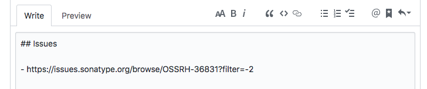
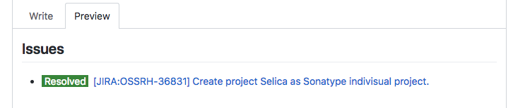

Chrome Extension for Atlassian Status Badge
----

This is chrome extension for atlassian services (jira, confluence, crucible).  
Add status badge to link to jira issue, confluence page, crucible review page.

## Overview

Someonw write jira issue link to any post.



This extension replace issue link text to status badge and summary.
And you can see issue status without visiting to jira issue page.



## How to Setup

1. Clone repository.

```
git clone git@github.com:takemikami/chrome-atlassian-status.git
```

2. Run Chrome.

3. Access to ``chrome://extensions/``

4. Enable developer mode.

5. Load unpackaged extension from cloned directory.

6. Go to extension option page. input parameters.
